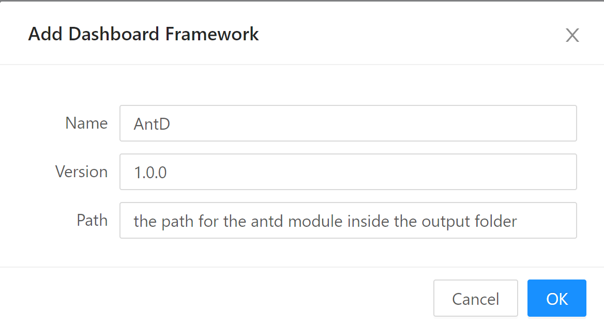

# UniversalDashboard.Antd

Ant-Design library as cutom components for universaldashboard

The module in this repo is still in development so there are bugs!!
the module was based on this awesome library <https://ant.design/docs/react/introduce>

I will try to add more components to this module but is goint to take time, they have a lot of components ( 63 )

## Build the module

01. You need the install powershell module InvokeBuild

```powershell
Install-Module -Name InvokeBuild -Scope CurrentUser -Force
```

02. Go to the src folder and run the command

```powershell
Invoke-Build
```

03. When the build process is finished you will have new folder name output that will contained the build module, just import the module.

```powershell
Import-Module .\output\UniversalDashboard.Antd\UniversalDashboard.Antd.psd1
```

## Notes

If you are using Powershell Universal and you wanna using Antd components in your dashboard , you nedd to add Antd as framework inside Powershell Universal

  
